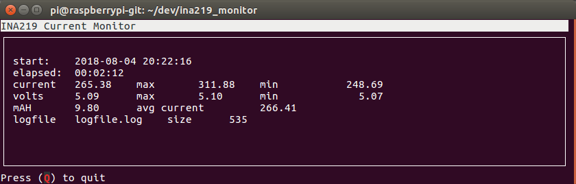
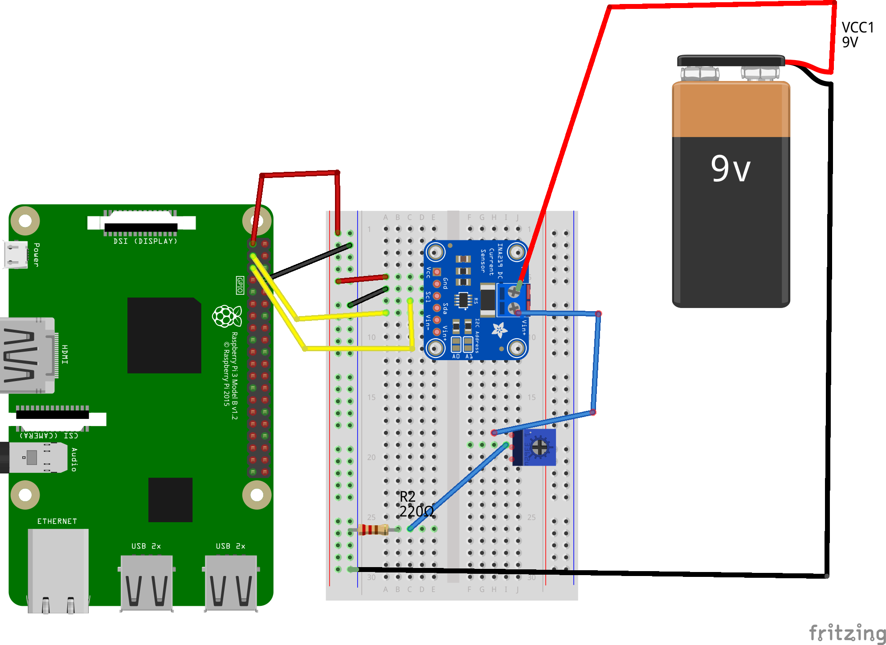

# ina219_monitor
This is a small program that lets you use your raspberry pi and an ina219 module to monitor voltage, current, and mAhs realtime as well as create a log file.

 


## Setup and Installation

### Hardware setup

You can skip this if your hardware is already working

First you need to have a raspberry pi and ina219 modules.  You can buy both at adafruit as well as many other vendors.  You will need to wire it up, enable i2c on your raspberry pi and test out the connections work. 

Raspberry Pi | INA 219 Module
-------------|---------------
	Pin 1 (3.3V) | VCC
	Pin 6 (GND) | GND
	Pin 4 (SCL) | SCL
	Pin 3 (SDA) | SDA
	
VIN+ and VIN- on the module connect to the high side of your load.  You can connect either via the header or the 2 pin screw terminal.  Adafruit has an excellent [tutorial](https://cdn-learn.adafruit.com/downloads/pdf/adafruit-ina219-current-sensor-breakout.pdf).

|  |
| :--:                                           |
| *Example setup with test load*                 |

Once you have wired it up it's a good idea to test it.  Again Adafruit has an excellent tutorial [here](https://learn.adafruit.com/adafruits-raspberry-pi-lesson-4-gpio-setup/configuring-i2c) on how to install and use i2cdetect to make sure you setup is correct. If it's working correctly you should see something like this

```
sudo i2cdetect -y 1

     0  1  2  3  4  5  6  7  8  9  a  b  c  d  e  f
00:          -- -- -- -- -- -- -- -- -- -- -- -- -- 
10: -- -- -- -- -- -- -- -- -- -- -- -- -- -- -- -- 
20: -- -- -- -- -- -- -- -- -- -- -- -- -- -- -- -- 
30: -- -- -- -- -- -- -- -- -- -- -- -- -- -- -- -- 
40: 40 -- -- -- -- -- -- -- -- -- -- -- -- -- -- -- 
50: -- -- -- -- -- -- -- -- -- -- -- -- -- -- -- -- 
60: -- -- -- -- -- -- -- -- -- -- -- -- -- -- -- -- 
70: -- -- -- -- -- -- -- --
```

### Software depedencies 

You will need to install the [pi-ina219](https://github.com/chrisb2/pi_ina219) python library as well as [urwid](http://urwid.org/).

```
sudo pip install pi-ina219
```
And then the urwid python library 
```
sudo pip install urwid
```
## Usage

```
python ina219_monitor.py
```

### Settings

There are a few constants in the code you might want to change depending upon your application.

* UPDATE\_INTERVAL Screen refreshes in seconds.  Defaults to 10 hz (0.1) 
* LOGGING\_INTERVAL Interval at which logs are written in second.  Defaults to once a minute (60)
* SHUNT\_OHMS Hardware configuration of your current sense resistor on your board.  Defaults to 0.1 ohms
* LOGFILE name of the logfile, defaults to "logfile.log" 
* MAX\_EXPECTED\_AMPS Maximum current expected in Amperes.  Used by pi_ina219 to configure hardware.  Defaults to 500mA (0.5)


